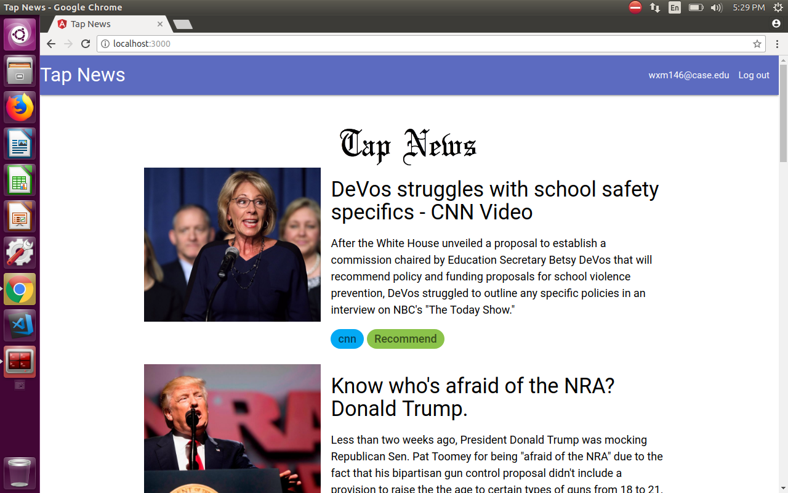
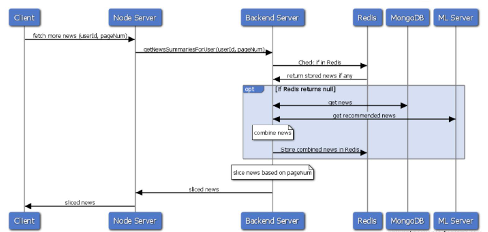
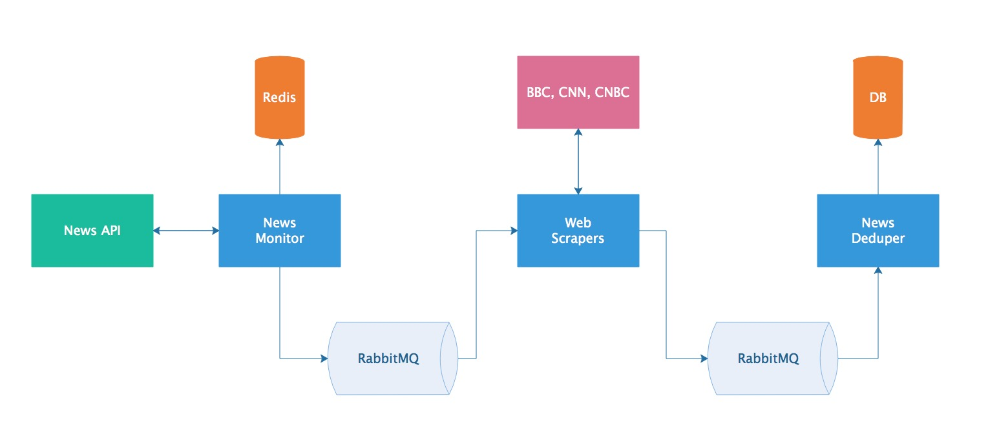
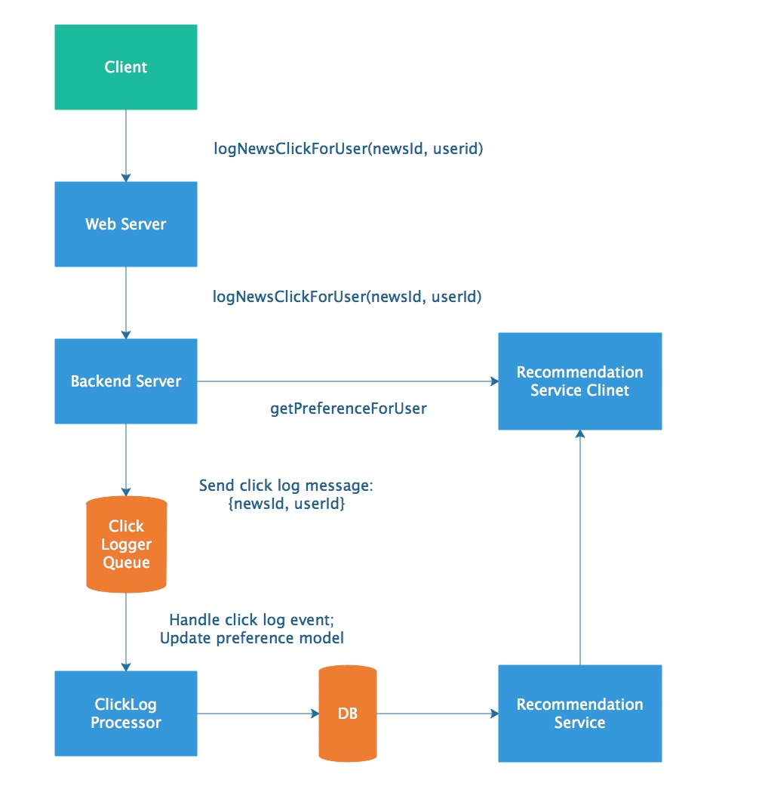

# Tap-News-System
This is a real-time news scraping and recommendation system implemented as a single-page application. The system uses a news pipeline to scrape latest news from various of sources such CNN, BBC. The front end is bootstrapped with React. To customize the news and perform recommendation, a training pipeline for news topic modeling was implemented at the back-end with Tensorflow. In particular, the backend services includes RESTful servers and RPC servers, a MongoDB database, a news scraper using Python Scrapy package as well as multiple cloud RabbitMQ message queues.

* Services provided
    - News Pipeline (obtaining news, deduping news and inserting news to database)
    - News Scraper  
    - Classifier with Tensorflow pre-trained CNN model 
    - News Recommender (logs and retrieve user preference)
    - Node.js (handling client-side requests)
    - Apache Zeppelin for data visualization and analysis   

## Installation

Tap-News requires [Docker](www.docker.com) to run.

Start the Docker Daemon, install the dependencies and devDependencies and start the service.

```sh
$ cd Tap-News
$ docker-compose build
$ docker-compose up
```

Alternatively, each component can be started manually, though no bash script shortcut is provided. In addition, dependencies for each component must be installed beforehand.

For example, to run backend server

```sh
cd backend_server
pip install -r requirements.txt # install necessary packages
python service.py # or python3
```

## Demo
. 

## Overall Architecture


## System Break-down
### Life Cycle Block Diagram
  

### News Pipeline  
News pipeline consists news monitor, web scraper and news deduper, news is sent and received between them by RabbitMQ which decouples these components. The news monitor use [News API](https://newsapi.org) to derive latest news and store news title MD5 digest into Redis to avoid sending same news to the message queue. The web scraper use a third party package [Newspaper](https://newspaper.readthedocs.io/en/latest/) to fetch corresponding news articles from offical news website. News depuper implements TF-IDF to calculate similarity of news to avoid storing same news from different news source into MongoDB. For similar news, only store the one published firstly.  
  

### Recommendation service 
A click log processor is built to implement a time decay model. If a news topic is clicked, p = (1-α)p + α, if not, p = (1-α)p, Where p is the selection probability, and α is the degree of weight decrease. The result of this is that the nth most recent selection will have a weight of (1-α)^n.    


### Authors

* **Zhekai Jin**


